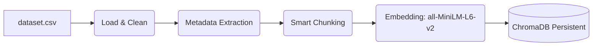

# 📊 RAG-Powered Financial Announcement Chatbot

> **Module: Data Ingestion & Vector Database Construction**
>
> This document details the implementation of **Requirements 1–3**, focusing on the data pipeline that powers the chatbot's retrieval capabilities.

---

## 1. Domain Selection (Req 1)

**Domain:** Saudi Stock Exchange (Tadawul) Corporate Announcements.

We utilize a dataset of financial disclosures, dividend announcements, and corporate contracts from publicly listed companies. This domain requires precise retrieval due to the quantitative nature of the data.

* **Source File:** `dataset.csv`
* **Total Documents:** **1,839** (Exceeds the minimum requirement of 50 documents).
* **Data Type:** Structured financial summaries and regulatory filings.

---

## 2. Document Processing (Req 2)

### A. Text Extraction & Cleaning
We process the raw CSV data to ensure high-quality retrieval.
* **Cleaning:** Removed rows with missing `DetailedSummary` to prevent empty context.
* **De-duplication:** Removed duplicate entries to avoid redundant search results.

### B. Metadata Extraction
To enable accurate **Source Citations** in the UI, we extract and attach specific metadata to every chunk:

| Field | Purpose |
| :--- | :--- |
| `source_id` | Unique identifier for tracking documents (e.g., `doc_102`). |
| `Title` | The subject of the announcement (displayed in citations). |
| `Date` | Critical for distinguishing between old and new financial news. |
| `Impact` | Contextual tag describing the financial impact. |

### C. Smart Chunking Strategy
We implemented a **Fixed-size Sliding Window** strategy to handle long financial reports while preserving context.

* **Chunk Size:** `800 characters` – Large enough to capture a full financial statement.
* **Overlap:** `100 characters` – Ensures that critical numbers or sentences are not split at the chunk boundary.
* **Filter:** Chunks smaller than 50 characters are discarded as noise.

> **Why this strategy?**
> Semantic boundaries in financial summaries can be irregular. A sliding window with overlap ensures we don't lose the connection between a "Company Name" and its "Dividend Value" if they fall on a split point.

---

## 3. Vector Database Implementation (Req 3)

We use **ChromaDB** in persistent mode to store embeddings. This ensures the database does not need to be rebuilt every time the application restarts.

* **Database:** `ChromaDB` (Persistent Client)
* **Storage Path:** `./chroma_db`
* **Embedding Model:** `sentence-transformers/all-MiniLM-L6-v2`
    * *Reasoning:* This model offers an excellent balance of speed and semantic accuracy for English text.

### Architecture Pipeline


##  How to Build the Database

To generate the vector database locally, follow these steps:

### 1. Install Dependencies
```bash
pip install pandas chromadb sentence-transformers tqdm

```

### 2. Run the Builder Script

```bash
python build_vector_db.py

```

### 3. Output

* You will see a progress bar for indexing.
* A folder `./chroma_db` will be created. **Do not delete this folder.**
* A `processed_chunks.json` file will be generated for debugging.

---

